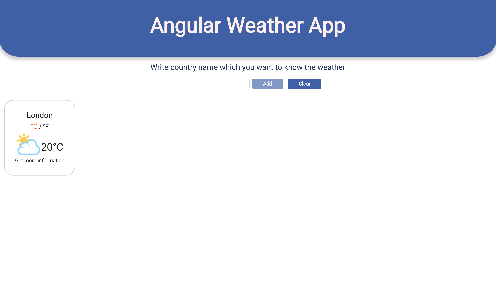
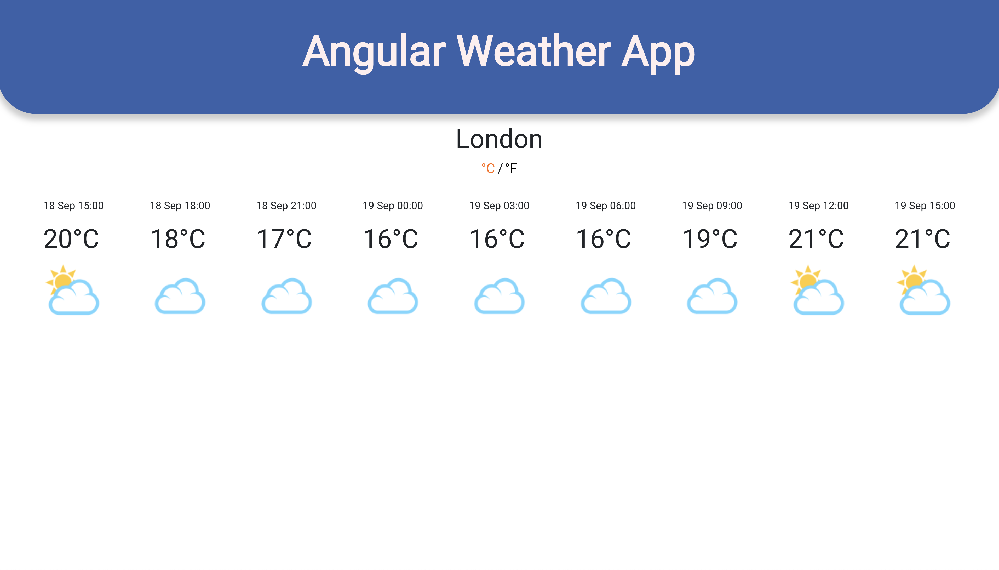

# Sometimes you want to know the weather in other cities of the world.

Advantages
* Created with [Angular](https://angular.io/) framework
* Temperature with *Celsius* and *Fahrenheit*
* Daily forecast weather.
* Animations

#

### *This project used API for get weather of all the cities in the world*
https://openweathermap.org/

## Open weather map [Partners and solutions](https://openweathermap.org/examples)

* start server: npm start
* build application: npm run build
